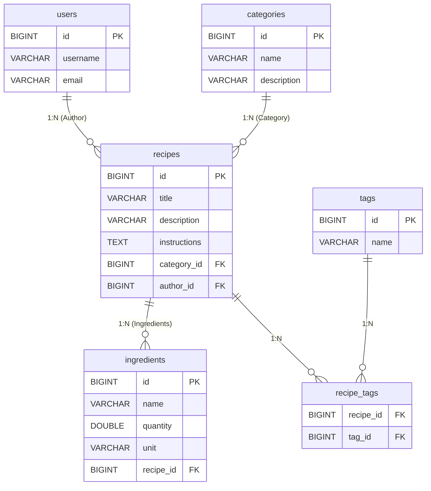

<h1 align="center"> 🍳 Recipe Book App </h1>

 <strong>Recipe Book App</strong> — это веб-приложение для хранения и управления кулинарными рецептами. Проект создан с использованием современного стека технологий Java и демонстрирует лучшие практики разработки бэкенда: многослойную архитектуру, работу с базами данных, обработку исключений и написание REST API. 

<h2>🚀 О проекте</h2>
Приложение позволяет пользователям:
<table> <thead> <tr> <th width="50">#</th> <th width="200">Возможность</th> <th>Описание</th> </tr> </thead> <tbody> <tr> <td>1️⃣</td> <td><b>Просмотр списка</b></td> <td>Все рецепты в одном месте</td> </tr> <tr> <td>2️⃣</td> <td><b>Детальная информация</b></td> <td>Ингредиенты, инструкции, время готовки</td> </tr> <tr> <td>3️⃣</td> <td><b>Добавление</b></td> <td>Новые кулинарные шедевры в коллекцию</td> </tr> <tr> <td>4️⃣</td> <td><b>Редактирование</b></td> <td>Изменение существующих рецептов</td> </tr> <tr> <td>5️⃣</td> <td><b>Удаление</b></td> <td>Очистка от ненужного</td> </tr> <tr> <td>6️⃣</td> <td><b>Поиск</b></td> <td>По названию или ингредиентам</td> </tr> </tbody> </table>
<h2>🛠 Стек технологий</h2>
Язык программирования
Java 25 — современная версия с новейшими возможностями и улучшениями производительности

Фреймворк
Spring Boot 4 — мощный фундамент для создания веб-приложений с минимальной конфигурацией

Сборщик проектов
Maven — автоматизация сборки и управление зависимостями

База данных
PostgreSQL — надежная и производительная реляционная база данных

## 📊 ER-диаграмма (Модель данных)

Ниже представлена ER-диаграмма, описывающая структуру базы данных приложения, включая первичные (PK) и внешние (FK) ключи, а также связи между таблицами (OneToMany, ManyToMany).

